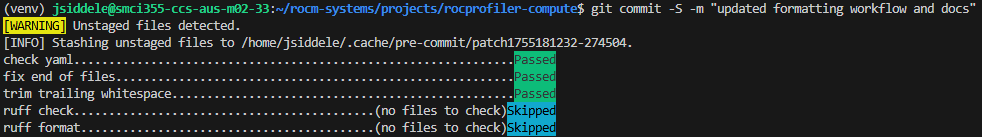

## How to fork from us

To keep our development fast and conflict free, we recommend you to [fork](https://github.com/ROCm/rocprofiler-compute/fork) our repository and start your work from our `develop` branch in your private repository.

Afterwards, git clone your repository to your local machine. But that is not it! To keep track of the original develop repository, add it as another remote.

```
git remote add mainline https://github.com/ROCm/rocprofiler-compute.git
git checkout develop
```

As always in git, start a new branch with

```
git checkout -b topic-<yourFeatureName>
```

and apply your changes there. For more help reference GitHub's ['About Forking'](https://docs.github.com/en/get-started/exploring-projects-on-github/contributing-to-a-project) page.

## How to contribute to ROCm Compute Profiler

### Did you find a bug?

- Ensure the bug was not already reported by searching on GitHub under [Issues](https://github.com/ROCm/rocprofiler-compute/issues).

- If you're unable to find an open issue addressing the problem, [open a new one](https://github.com/ROCm/rocprofiler-compute/issues/new).

### Did you write a patch that fixes a bug?

- Open a new GitHub [pull request](https://github.com/ROCm/rocprofiler-compute/compare) with the patch.

- Ensure the PR description clearly describes the problem and solution. If there is an existing GitHub issue open describing this bug, please include it in the description so we can close it.

- Ensure the PR is based on the `develop` branch of the ROCm Compute Profiler GitHub repository.

> [!TIP]
> To ensure you meet all formatting requirements before publishing, we recommend you utilize our included [*pre-commit hooks*](https://pre-commit.com/#introduction). For more information on how to use pre-commit hooks please see the [section below](#using-pre-commit-hooks).

## Using pre-commit hooks

Our project supports optional [*pre-commit hooks*](https://pre-commit.com/#introduction) which developers can leverage to verify formatting before publishing their code. Once enabled, any commits you propose to the repository will be automatically checked for formatting. Initial setup is as follows:

```console
python3 -m pip install pre-commit
cd rocprofiler-compute
pre-commit install
```

Now, when you commit code to the repository you should see something like this:



Please see the [pre-commit documentation](https://pre-commit.com/#quick-start) for additional information.

## Contribution Guidelines

To ensure code quality and consistency, we use **Ruff**, a fast Python linter and formatter. Before submitting a pull request, please ensure your code is formatted and linted correctly. This is the manual alternative to running ruff pre-commit hooks.

-----

### Installing and Running Ruff

Ruff is available on PyPI and can be installed using `pip`:

```bash
pip install ruff
```

Once installed, you can run Ruff from the command line. To check for linting errors and formatting issues, navigate to the project root and run:

```bash
ruff check .
ruff format --check .
```

To automatically fix most of the issues detected, you can use the `--fix` flag with the `check` command and run the `format` command without the `--check` flag:

```bash
ruff check --fix .
ruff format .
```

-----

### Type Annotation Guidelines

This project enforces type annotations using Ruff's `flake8-annotations` rules (ANN). All new code in `src/` must include proper type annotations.

#### Requirements

- All function arguments must have type annotations (except `self` and `cls`)
- All function return types must be annotated
- Class attributes should have type annotations where applicable

#### Examples

```python
# Good - properly annotated
def process_kernel_data(kernel_name: str, metrics: list[float]) -> dict[str, Any]:
    """Process kernel performance metrics."""
    return {"kernel": kernel_name, "avg": sum(metrics) / len(metrics)}

# Bad - missing annotations (will be caught by Ruff)
def process_kernel_data(kernel_name, metrics):
    return {"kernel": kernel_name, "avg": sum(metrics) / len(metrics)}
```

#### Checking Type Annotations

To specifically check for missing type annotations:

```bash
ruff check --select ANN .
```

For existing code, we're gradually adding type annotations. When modifying existing functions, please add type annotations to any code you touch.

-----

### String Formatting Guidelines

This project enforces modern Python string formatting practices using Ruff's `pyupgrade` rules (UP). All new code in `src/` should use f-strings where applicable instead of older formatting methods.

#### Requirements

- Use f-strings for string formatting when variables or expressions need to be embedded
- Replace `.format()` method calls and `%` formatting with f-strings where possible
- F-strings are preferred for readability and performance

#### Examples
```python
# Good - using f-strings
name = "kernel_analysis"
count = 42
message = f"Processing {name} with {count} metrics"
path = f"{base_dir}/results/{filename}.csv"

# Bad - will be caught by Ruff (UP045)
message = "Processing {} with {} metrics".format(name, count)
message = "Processing %s with %s metrics" % (name, count)
path = "{}/results/{}.csv".format(base_dir, filename)
```

-----

### Path Handling Guidelines

This project enforces modern Python path handling practices using Ruff's `flake8-use-pathlib` rules (PTH). All new code in `src/` should use `pathlib.Path` methods instead of legacy `os.path` functions for directory operations.

#### Requirements

- Use `pathlib.Path` methods for all path operations instead of `os.path` functions
- Use `Path.cwd()` instead of `os.getcwd()`
- Use `Path.exists()` instead of `os.path.exists()`
- Use `Path.is_file()` and `Path.is_dir()` instead of `os.path.isfile()` and `os.path.isdir()`
- Use the `/` operator for path joining instead of `os.path.join()`

#### Examples
```python
# Good - using pathlib methods
current_dir = Path.cwd()
config_path = current_dir / "config" / "settings.yaml"
if config_path.exists() and config_path.is_file():
    # Process file

# Bad - will be caught by Ruff (PTH rules)
import os
current_dir = Path(os.getcwd())  # PTH109
config_path = os.path.join(current_dir, "config", "settings.yaml")  # PTH118
if os.path.exists(config_path) and os.path.isfile(config_path):  # PTH110, PTH113
    # Process file
```

-----

### Disabling Formatting for Specific Sections

There may be instances where you need to disable Ruff's formatting on a specific block of code. You can do this using special comments:

  * **`# fmt: off`** and **`# fmt: on`**: These comments can be used to disable and re-enable formatting for a block of code.
  * **`# fmt: skip`**: This comment, placed at the end of a line, will prevent Ruff from formatting that specific statement.

You can also disable specific linting rules for a line by using `# noqa: <rule_code>`.

### Coding guidelines

Below are some repository specific guidelines which are followed througout the repository.
Any future contributions should adhere to these guidelines:
* Use the `pathlib` library functions instead of `os.path` for manipulating the file paths.

### Build and test documentation changes

For instructions on how to build and test documentation changes (files under docs folder), please see https://rocm.docs.amd.com/en/latest/contribute/contributing.html